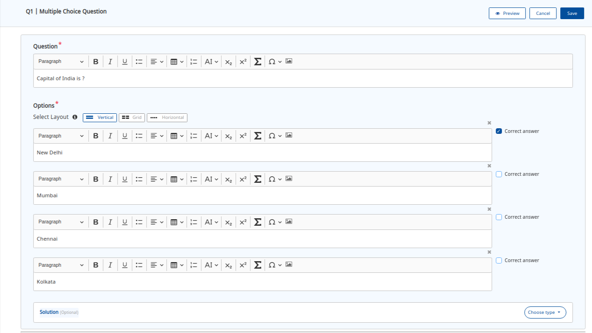
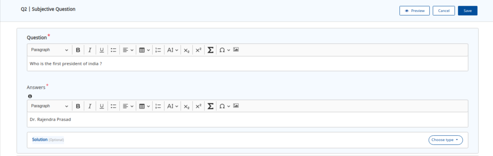

# Capabilities

In this section, we will cover in a little detail about each of the key capabilities of the inQuiry building block.

### **a) Question Set Editor**&#x20;

Question set editor is a tool offered by inQuiry to help you kickstart your creation of **Question Banks**. The key capabilities of this editor are:

* Extendible, Installable and configurable:&#x20;
  * It provides a set of features and configurations. It is an npm package that can be installed and configured with ease.&#x20;
  * Configuration driven: This allows you to unleash different capabilities for different workflows.&#x20;
  * It is built using an angular tech stack and can be installed and used in any portal built using angular. It can also be extended to build native integrations with JS and React frameworks.
* Create new questions or reuse already live questions to stitch a question set with proper metadata tagging.
* Create question sets with multiple sections.&#x20;
* Ability to define the consumption behaviour of the question set. For example:- show hint, solution, set timer, etc.
* Ability to preview question set to replicate the actual user experience before publishing it.
* In-built curation workflows to ensure that only reviewed question sets are published.

### **b) Question Editor**&#x20;

Question editor enables you to create **diverse question types:**

* The inQuiry comes with two pre-built question types:&#x20;
  * **Multiple choice questions:** It is an interactive type of question having multiple options out of which one option is the correct answer.

* **Subjective questions:** It is a non-interactive type of question that contains one answer.

It can be extended to build other question types as per your need.

* Allows you to create questions with rich text, format text, images, and math equations amongst others with proper metadata tagging.

### **c) Question & Question Set services**&#x20;

It enables the **End-to-end publishing process**. These are microservices that allow you to: ****&#x20;

* Create, collaborate, curate & publish question(s) and question set(s).&#x20;
* Easily scale as per your needs.
* Unbundle the microservices to create different solutions using the same set of microservices.

### **d) Question Set Player (QuML player)**&#x20;

Question set player is a player provided by inQuiry to create **engaging & inclusive experiences** for end users consuming the question sets. The key capabilities of this player are:&#x20;

* Extendible, installable, and configurable:&#x20;
  * It provides a set of features and configurations. It is an npm package that can be installed and configured with ease.&#x20;
  * Configuration driven: This allows you to configure the player with different capabilities for different workflows. &#x20;
  * It can be plugged into any hybrid mobile app or can be played in web view. Can be extended to build native integrations with JS and React frameworks.
* Inclusive:
  * Built as per the WCAG AA recommendations allowing you to reach a wider audience from day 1.
* Offline & Online:
  * Built to support both online and offline modes of consumption.
* Enables a variety of solutions:
  * Allows you to use question sets for different use cases. For example:- the user experience for practice worksheets can be configured to show feedback, hints for each question. However, a high stake assessment can be configured to have a completely different consumption behaviour with randomization of questions, a limited number of attempts, and a completion timer.&#x20;
*   Responsive to different resolutions and orientations.&#x20;

    ****

### **e) Analytics:**&#x20;

Every single user interaction is instrumented as per the Sunbird telemetry spec. Therefore, allowing you to use this granular data to create custom reports to turn user actions into insights. Here are the events specific to inQuiry:

* START - Capture the start of a question/question set session.
* ASSESS - Capture score and assessment data.
* RESPONSE - Capture user responses.
* END -Capture the end of a question/question set session.

Click [here](https://github.com/sunbird-specs/Telemetry/blob/3.3.0/specification.md) to know more about Sunbird telemetry spec.

### **Use-Cases**

inQuiry capabilities can power a variety of use-cases. A few examples are shown below:&#x20;

### **Additional Information**

Below recording from one of the Sunbird webinars provides more information about the capabilities enabled by inQuiry, the QuML spec, and the technical architecture.



